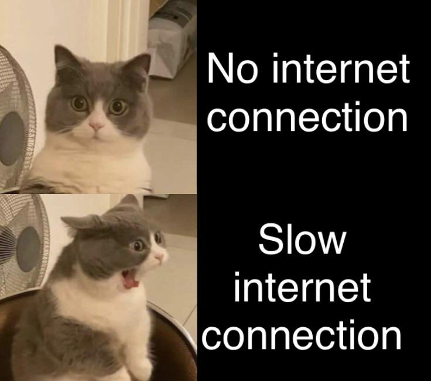
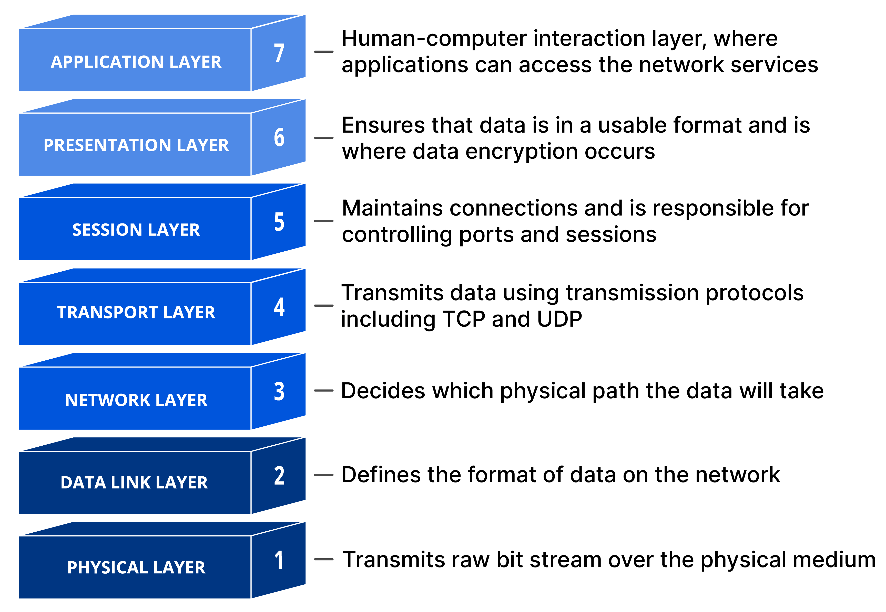

# Containerization and Network Engineering

Phate

----

- [alex/what-happens-when](https://github.com/alex/what-happens-when)
- [vasanthk/how-web-works](https://github.com/vasanthk/how-web-works)
- Network Engineering
- Containerization

----

## Network Engineering

----



----

### OSI Model or TCP/IP Protocol

- Application layer
  - HTTP, FTP, SSH
- Presentation or Session layer
  - SSL, TLS (HTTPS)
- Transport layer
  - TCP, UDP
- Network layer
  - IP, ICMP
  - Switch, Router
- Data link layer
  - Ethernet, PPP
- Physical layer
  - Cables, Hubs



----


----

### Network topology


----

### Debugging

- [Wireshark](https://www.wireshark.org/)

- Ping [Pong]

```shell
$ ping -c 4 google.com
PING google.com (142.250.66.78) 56(84) bytes of data.
64 bytes from hkg12s27-in-f14.1e100.net (142.250.66.78): icmp_seq=1 ttl=111 time=12.4 ms
64 bytes from hkg12s27-in-f14.1e100.net (142.250.66.78): icmp_seq=2 ttl=111 time=12.7 ms
64 bytes from hkg12s27-in-f14.1e100.net (142.250.66.78): icmp_seq=3 ttl=111 time=11.5 ms
64 bytes from hkg12s27-in-f14.1e100.net (142.250.66.78): icmp_seq=4 ttl=111 time=9.40 ms

--- google.com ping statistics ---
4 packets transmitted, 4 received, 0% packet loss, time 3005ms
rtt min/avg/max/mdev = 9.399/11.529/12.724/1.304 ms
```

----

- Traceroute

```shell
$ traceroute google.com
traceroute to google.com (142.250.66.78), 30 hops max, 60 byte packets
 1  AllNewPCII.mshome.net (172.27.32.1)  0.188 ms  0.169 ms  0.156 ms
 2  192.168.0.1 (192.168.0.1)  0.887 ms  0.538 ms  0.862 ms
 3  dsldevice.lan (192.168.1.254)  4.975 ms  5.864 ms  6.860 ms
 4  * * *
 5  192.168.41.245 (192.168.41.245)  10.844 ms  10.822 ms  10.812 ms
 6  GANGDU-X68-2-PO2-VIP.IX.homeplus.net.tw (203.133.92.173)  24.941 ms  21.377 ms  21.356 ms
 7  CL-BR93-2-PO13-GANGDU.IX.kbtelecom.net (203.187.23.241)  24.155 ms  18.970 ms CL-BR93-1-PO3-GANGDU.kbtelecom.net (203.187.22.254)  18.972 ms
 8  TPNOC1-SC93-VL714-CLINGLIAN.IX.kbtelecom.net (203.187.6.45)  20.623 ms  12.893 ms TPNOC1-MKII-SC93-VL734-CHINGLIAN.IX.kbtelecom.net (203.187.9.253)  31.806 ms
 9  TPNOC1-P93-2-ETH1-49-SC93.IX.kbtelecom.net (203.187.6.130)  41.719 ms TPNOC1-P93-2-ETH1-51-MKII-SC93.kbtelecom.net (203.187.6.138)  29.933 ms *
10  * * CHIEF-P93-2-PO86-TPNOC1.IX.kbtelecom.net (203.187.9.66)  35.356 ms
11  72.14.213.145 (72.14.213.145)  39.320 ms 72.14.216.61 (72.14.216.61)  38.331 ms *
12  192.178.105.193 (192.178.105.193)  33.237 ms * *
13  142.251.226.168 (142.251.226.168)  21.072 ms 209.85.243.197 (209.85.243.197)  18.015 ms 209.85.245.65 (209.85.245.65)  28.555 ms
14  hkg12s27-in-f14.1e100.net (142.250.66.78)  27.444 ms 192.178.106.166 (192.178.106.166)  35.437 ms 209.85.243.197 (209.85.243.197)  12.452 ms
```

----

- ip address

```shell
$ ip addr
1: lo: <LOOPBACK,UP,LOWER_UP> mtu 65536 qdisc noqueue state UNKNOWN group default qlen 1000
    link/loopback 00:00:00:00:00:00 brd 00:00:00:00:00:00
    inet 127.0.0.1/8 scope host lo
       valid_lft forever preferred_lft forever
    inet 10.255.255.254/32 brd 10.255.255.254 scope global lo
       valid_lft forever preferred_lft forever
    inet6 ::1/128 scope host
       valid_lft forever preferred_lft forever
2: eth0: <BROADCAST,MULTICAST,UP,LOWER_UP> mtu 1500 qdisc mq state UP group default qlen 1000
    link/ether 00:15:5d:64:7a:c2 brd ff:ff:ff:ff:ff:ff
    inet 172.27.43.151/20 brd 172.27.47.255 scope global eth0
       valid_lft forever preferred_lft forever
    inet6 fe80::215:5dff:fe64:7ac2/64 scope link
       valid_lft forever preferred_lft forever
```

----

#### HTTP Debugging

- Status codes
  - 1xx: hold on
  - 2xx: here you go
  - 3xx: go away
  - 4xx: you fucked up
  - 5xx: I fucked up

- cURL

```shell
$ curl -I https://www.google.com
HTTP/2 200
```

- [HTTP Cats](https://http.cat/)
- [MDN Web Docs](https://developer.mozilla.org/en-US/docs/Web/HTTP/Reference/Status)

----

### Question

Which parts of an HTTPS request are encrypted?


----

### Answer


- request line (method, URL, parameters)
- headers
- body

- DNS? DoH, DoT

----

### References

- [How to Become a Network Engineer in 2025!](https://youtu.be/0akMyLijNVg)
- [什麼是 OSI 模型？](https://www.cloudflare.com/zh-tw/learning/ddos/glossary/open-systems-interconnection-model-osi/)
- [OSI 七層架構和 TCP/IP 通訊協定的比較](https://hackmd.io/@Pang-Chang/BkQK8_tjF)
- [什麼是網際網路通訊協定？](https://www.cloudflare.com/zh-tw/learning/network-layer/internet-protocol/)
- [企業資料通訊Week4 (3) | HTTP message](https://ithelp.ithome.com.tw/articles/10282071)

----
